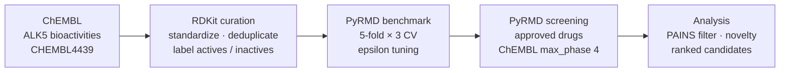

# AI-Assisted Drug Discovery for Liver Fibrosis: PyRMD Virtual Screening against TGF-β Receptor I (ALK5)


This repository is a reproducible version of the workflow from my BS Chemistry thesis at the
**University of the Punjab**. The workflow uses **PyRMD**, a fully automated AI-powered ligand-based virtual
screening tool, to look for approved drugs that could be repurposed as inhibitors of **TGF-β receptor type I (ALK5)**,
a key driver of liver fibrosis.

**Author:** Hassan Rafiq · MPhil Chemistry (Biochemistry), University of the Punjab
[ORCID 0009-0009-7500-5694](https://orcid.org/0009-0009-7500-5694) · [LinkedIn](https://www.linkedin.com/in/hassan-rafiq933) · hassan.res.chem@pu.edu.pk

---

## Background

Liver fibrosis is the build-up of scar tissue (extracellular matrix) that follows chronic liver injury from
viral hepatitis, alcohol or metabolic dysfunction-associated steatotic liver disease (MASLD). Without treatment it can
progress to cirrhosis and liver cancer. The main pro-fibrotic signal is **TGF-β1**, which activates hepatic stellate
cells through its type I receptor kinase **ALK5 (TGFBR1)**. Blocking ALK5 with a small molecule is therefore a
well-established anti-fibrotic strategy.

Finding a new drug is slow and expensive, and **ligand-based virtual screening** helps narrow the search.
A machine-learning model learns from compounds whose ALK5 activity is already measured, then ranks unseen
molecules by how likely they are to be active. Here the unseen molecules are **approved drugs**, so any hit already
has human safety data and could be repurposed faster than a new compound.

## Workflow



| Step | What happens | Where |
|---|---|---|
| 1. Data retrieval | IC50, Ki, Kd and EC50 records for ALK5 are downloaded from ChEMBL | `notebooks/01_data_curation.ipynb` |
| 2. Curation | Records without nM units or with ChEMBL validity warnings are removed. Structures are standardized with RDKit (largest fragment, neutralization, canonical SMILES) and merged by InChIKey | `notebooks/01_data_curation.ipynb` |
| 3. Labelling | **Active** ≤ 1 µM, **inactive** ≥ 10 µM. The 1–10 µM grey zone and contradictory compounds are excluded | `notebooks/01_data_curation.ipynb` |
| 4. Exploration | Potency distribution, Lipinski/TPSA profile, Bemis–Murcko scaffolds, and a Morgan-fingerprint PCA of chemical space | `notebooks/01_data_curation.ipynb` |
| 5. Benchmark | PyRMD (Random Matrix Discriminant algorithm, MHFP fingerprints) is validated by repeated stratified k-fold cross-validation | `config/benchmark.ini` |
| 6. Tuning | The epsilon cutoffs are scanned over the grid the PyRMD authors recommend, and the best combination is chosen by Youden's J (TPR − FPR) | `scripts/epsilon_scan.py` |
| 7. Screening | The trained model screens the approved-drug library | `config/screening.ini` |
| 8. Analysis | PAINS and known actives are removed, candidates are ranked by RMD score, novelty is checked, and a summary is written | `notebooks/02_results_analysis.ipynb` |

## Results

After the pipeline has run, **[`results/summary.md`](results/summary.md)** contains the dataset sizes, the
cross-validated benchmark metrics (TPR, FPR, precision, F-score, ROC AUC, PRC AUC, BEDROC with 95 % CIs) and the
top-ranked repurposing candidates. Figures are saved in [`figures/`](figures/).

## Repository structure

```
├── notebooks/
│   ├── 01_data_curation.ipynb      # ChEMBL retrieval, RDKit standardization, EDA, training-set export
│   └── 02_results_analysis.ipynb   # benchmark metrics, screening hits, summary report
├── config/
│   ├── benchmark.ini               # PyRMD benchmark mode
│   └── screening.ini               # PyRMD screening mode
├── scripts/
│   ├── run_pyrmd.py                # runs PyRMD from the right folder
│   └── epsilon_scan.py             # epsilon cutoff optimisation
├── data/
│   ├── raw/                        # raw ChEMBL download
│   └── processed/                  # curated actives/inactives + screening library
├── results/                        # PyRMD outputs and summary.md
├── figures/                        # plots and structure grids
├── pyrmd/                          # place PyRMD_v1.03.py here (not redistributed)
├── environment.yml                 # environment for the notebooks
└── requirements-pyrmd.txt          # pip alternative for running PyRMD on Python 3.11
```

## How to reproduce

**1. Notebook environment**

```bash
conda env create -f environment.yml
conda activate alk5-notebooks
```

**2. Get PyRMD.** Download `PyRMD_v1.03.py` from the [official repository](https://github.com/cosconatilab/PyRMD) into
the `pyrmd/` folder, then create its environment. Use either the authors' conda file:

```bash
conda env create -f pyrmd_environment.yml     # from the PyRMD repository
```

or, on Python 3.11, the pinned pip versions tested with this project:

```bash
python -m venv pyrmd-env && source pyrmd-env/bin/activate   # Windows: pyrmd-env\Scripts\activate
pip install -r requirements-pyrmd.txt
```

**3. Curate the data.** Run `notebooks/01_data_curation.ipynb` in the `alk5-notebooks` environment. If the ChEMBL
web service is slow, you can download the ALK5 activity table from the
[ChEMBL target page](https://www.ebi.ac.uk/chembl/explore/target/CHEMBL4439) instead. Save it as
`data/raw/chembl_export.csv` and set `DATA_SOURCE = "csv"`.

**4. Run PyRMD** (in the PyRMD environment, from the repository root):

```bash
python scripts/run_pyrmd.py benchmark
python scripts/epsilon_scan.py --apply     # optional, 12 benchmark runs; can take an hour or more
python scripts/run_pyrmd.py screening
```

**5. Analyse.** Run `notebooks/02_results_analysis.ipynb`, which writes `results/summary.md`.

## Tools

Python · RDKit · PyRMD · ChEMBL web services · pandas · NumPy · scikit-learn · matplotlib · seaborn · Jupyter

## References

1. Amendola G., Cosconati S. *PyRMD: A New Fully Automated AI-Powered Ligand-Based Virtual Screening Tool.*
   J. Chem. Inf. Model. 2021, 61 (8), 3835–3845. [doi:10.1021/acs.jcim.1c00653](https://doi.org/10.1021/acs.jcim.1c00653)
2. Lee A. A. et al. *Ligand biological activity predicted by cleaning positive and negative chemical correlations.*
   PNAS 2019, 116 (9), 3373–3378. [doi:10.1073/pnas.1810847116](https://doi.org/10.1073/pnas.1810847116)
3. Zdrazil B. et al. *The ChEMBL Database in 2023: a drug discovery platform spanning multiple bioactivity data types and time periods.* Nucleic Acids Res. 2024, 52 (D1), D1180–D1192.
   [doi:10.1093/nar/gkad1004](https://doi.org/10.1093/nar/gkad1004)
4. Baell J. B., Holloway G. A. *New substructure filters for removal of pan assay interference compounds (PAINS).*
   J. Med. Chem. 2010, 53 (7), 2719–2740. [doi:10.1021/jm901137j](https://doi.org/10.1021/jm901137j)

## License

The code in this repository is released under the MIT License. PyRMD is developed by the
[Cosconati Lab](https://github.com/cosconatilab/PyRMD) and distributed under the AGPL-3.0 license. It is not included here.
